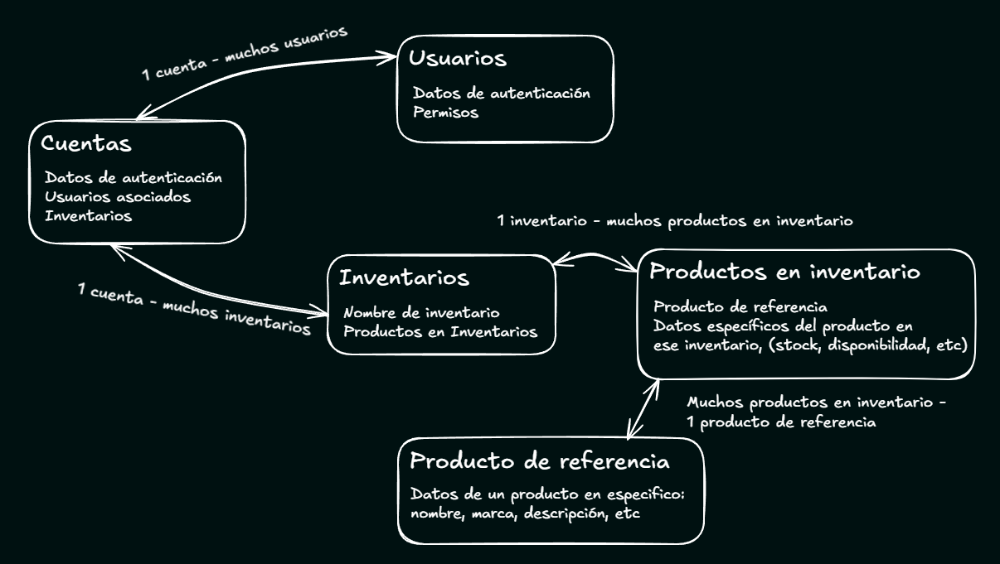

<h1>Sistema de gestión de inventarios de productos</h1>

*Versión 1.0.0, fecha de primer lanzamiento Agosto de 2025*

Sistema de APIs diseñado para que usuarios puedan registrarse y crear distintos inventarios que pueden llenar con productos según lo requieran.

Trabaja con base de datos y seguridad a traves de autenticaciones y autorizaciones. Las cuentas creadas por defecto crean un sub-usuario *admin* que, además de poder crear inventarios, también puede registrar a otros sub-usuarios y otorgarle distintos permisos que pueden variar para cada inventario. Permisos como el de agregar productos, eliminarlos, editar el inventario, entre otros.

> #### Ejemplo de uso: 
>
>  Suponiendo que una **cadena de farmacias** desea utilizar la aplicación podría hacerlo de la siguiente forma:
> - Una **cuenta** representa a la empresa principal.  
> - Dentro de la cuenta se crean varios **inventarios**, uno por cada sucursal (ej. "Sucursal Norte", "Sucursal Centro", "Sucursal Sur").  
> - Los **productos** (medicamentos, insumos, cosméticos) pueden estar disponibles en una sola sucursal o compartirse entre varias.  
> - Los **sub-usuarios** representan a los empleados de cada sucursal, con permisos específicos.  
>   - Por ejemplo: un **farmacéutico** puede actualizar productos, un **cajero** solo registrar ventas, ambos solo para los productos que corresponden a su sucursal. En cambio, un **gerente general** por ejemplo, puede administrar todo de todos los inventarios asociados a la cuenta.
>
> De esta manera, la aplicación permite centralizar el control de los productos en cada sucursal, compartiéndolos cuando sea necesario, a su vez que se asignan permisos claros a cada rol dentro de la empresa.

**Índice**
- [Fundamentación del diseño y arquitectura de software](#fundamentación-del-diseño-y-arquitectura-de-software)
  - [Estilo arquitectónico](#estilo-arquitectónico)
  - [Modelo de dominio](#modelo-de-dominio)
    - [Productos](#productos)
    - [Inventarios](#inventarios)
    - [Cuentas](#cuentas)
    - [Usuarios (sub-usuarios)](#usuarios-sub-usuarios)
  - [Resumen de tecnologías y herramientas elegidas](#resumen-de-tecnologías-y-herramientas-elegidas)
  - [Componentes y patrón arquitectónico](#componentes-y-patrón-arquitectónico)
    - [Microservicio de Usuarios](#microservicio-de-usuarios)
    - [Microservicio de Inventarios](#microservicio-de-inventarios)
    - [Microservicio de Productos](#microservicio-de-productos)
    - [Microservicio para la API Gateway](#microservicio-para-la-api-gateway)
    - [Microservicio para pruebas end to end (E2E)](#microservicio-para-pruebas-end-to-end-e2e)
  - [Flujo de interacción de las solicitudes y entre microservicios](#flujo-de-interacción-de-las-solicitudes-y-entre-microservicios)
  - [Otros aspectos](#otros-aspectos)
    - [Patrones de diseño](#patrones-de-diseño)
    - [Patrones y decisiones arquitectónicas](#patrones-y-decisiones-arquitectónicas)
    - [Entornos y perfiles](#entornos-y-perfiles)
- [Instrucciones de instalación y requisitos para ejecución local](#instrucciones-de-instalación-y-requisitos-para-ejecución-local)
  - [Variables de entorno](#variables-de-entorno)
    - [Ejemplo de valores](#ejemplo-de-valores)
  - [En caso de usar docker](#en-caso-de-usar-docker)
  - [En caso de no usar docker](#en-caso-de-no-usar-docker)
    - [Windows](#windows)
    - [Linux / macOS](#linux--macos)
- [Autenticación y autorización](#autenticación-y-autorización)
  - [Sobre el token](#sobre-el-token)
  - [Permisos](#permisos)
- [Endpoints y operaciones](#endpoints-y-operaciones)
  - [Servicio de usuarios](#servicio-de-usuarios)
    - [Posibles retornos](#posibles-retornos)
    - [Cuentas y sub-usuarios](#cuentas-y-sub-usuarios)
    - [Autenticaciones. Logins y logouts](#autenticaciones-logins-y-logouts)
  - [Servicio de productos](#servicio-de-productos)
  - [Servicio de inventarios](#servicio-de-inventarios)
    - [Queries - operaciones de lectura](#queries---operaciones-de-lectura)
    - [Mutations - operaciones de escritura](#mutations---operaciones-de-escritura)
    - [Types e inputs](#types-e-inputs)
- [Testing y prueba del sistema](#testing-y-prueba-del-sistema)
  - [Ejecución de tests](#ejecución-de-tests)
  - [Prueba con Postman](#prueba-con-postman)
    - [Datos de ejemplo](#datos-de-ejemplo)


### Funcionalidades generales
* Los usuarios pueden registrar una cuenta e iniciar sesión en el sistema.

* Durante el registro, también se configuran los datos del sub-usuario administrador principal.

* Cada cuenta puede tener múltiples inventarios, que pueden ser creados, editados y eliminados por el sub-usuario administrador.

* Las cuentas permiten la creación de sub-usuarios con nombre de usuario, contraseña y permisos específicos.

* Los sub-usuarios pueden tener distintos roles como "admin", "general", "jefe de categoría", etc.

* Los permisos de cada sub-usuario se asignan por inventario, lo que permite:
  * Diferentes permisos en cada uno.
  * Mayor control de acceso y acciones disponibles.
  
* El sub-usuario administrador puede:
  * Gestionar inventarios (crear, eliminar, renombrar).
  * Crear y configurar sub-usuarios.
  * Realizar cualquier acción permitida a los sub-usuarios.

* La sesión puede iniciarse tanto únicamente con la cuenta principal (para visualizar inventarios) como también con un sub-usuario (para operar según sus permisos).
  * Antes de iniciarla como sub-usuario se debe iniciarla como cuenta.

* Los productos pueden:
  * Agregarse, editarse, eliminarse.
  * Buscarse por atributos como nombre, marca, stock, categoría o disponibilidad.
  * Compartirse entre inventarios, conservando sus datos generales pero permitiendo redefinir atributos específicos como stock y disponibilidad.

## Fundamentación del diseño y arquitectura de software
Como se mencionó antes, la idea de este proyecto es brindar una solución del lado del servidor segura y eficaz que permita a usuarios, o grupo de personas, trabajar con inventarios de una forma práctica. Pensada principalmente para negocios u organizaciones. En donde es probable que sean varias personas las que accedan a estos inventarios, pero en donde no todas ellas podrían realizar las mismas acciones sobre los datos que alojan.

Entonces, este sistema de APIs debería poder brindarle al cliente:
* La posibilidad de registrar y "loguear" usuarios al sistema de forma segura.
* La opción de crear uno o más inventarios y llenarlos con los datos de los productos o items que necesiten los usuarios.
* La alternativa de que las cuentas puedan tener distintos sub-usuarios. Siendo uno el que se encargaría de asignar los permisos para el resto, permitiendo así distintos niveles de acceso a los datos asociados a la cuenta.
* La decisión de los datos que desea obtener de las solicitudes.
* Que los permisos asignados puedan variar según el inventario, en el caso que hayan varios en la misma cuenta.

Y en cuánto al trabajo interno del sistema, éste debería:
* Poder guardar los datos de forma persistente en él.
* Guardar datos sensibles de forma segura, por ejemplo encriptando contraseñas y validando los parámetros que ingresan en las solicitudes.
* Trabajar con autenticaciones y autorizaciones en sus operaciones.
* Validar, además de los permisos del sub-usuario, que las acciones que una cuenta quiera realizar sean sobre los datos asociados a ella únicamente.
* Tener en cuenta la posibilidad de extensión, tanto de nuevas funciones como de las iniciales.
* Ser fácil de entender, mantener y escalar.

### Estilo arquitectónico
Viendo las necesidades se concluyó que los sistemas monolíticos tradicionales no ofrecían la flexibilidad, escalabilidad ni la facilidad de mantenimiento necesarias para este caso. Especialmente considerando la proyección de crecimiento y la necesidad de integrar futuros módulos, aún siendo este inicialmente un proyecto de demostración.

Para dar solución, se optó por una **arquitectura de microservicios**, donde cada funcionalidad principal se implementa como un servicio independiente. Esto permite:

* El escalado y mantenimiento independiente para cada servicio.
* Despliegue individual sin afectar a los demás.
* Aislamiento de fallos: si un servicio falla, el resto puede seguir funcionando.
* Posibilidad de usar distintos tipos de API según las necesidades. Por ejemplo GraphQL para dar esa flexibilidad al cliente de obtener solo los datos que requiera, y Rest para cuando es necesario enviar y/o recibir todos los datos.

Esto constaría de:
* Comunicación sincrónica vía HTTP (REST/GraphQL). Por el momento no se requiere de comunicación asincrónica, u orientada a eventos, ya que las funcionalidades iniciales necesitan que los datos se procesen para poder validar y seguir la operación en el trabajo interno.
* API Gateway como punto de entrada único.
* Uso de JWT para autenticación y autorización distribuida.

### Modelo de dominio
Teniendo esto en cuenta lo que se busca la aplicación permita, ésta giraría entorno a estas 3 entidades principalmente: <u>Cuentas</u> (en donde se registrarían los usuarios), <u>Inventarios y Productos</u>.

Como se mencionó es probable que en un negocio, o empresa, no se desee que cualquiera con acceso a la cuenta pueda realizar grandes cambios en los datos, entonces se decidió agregar una cuarta entidad: <u>Usuarios</u> (sub-usuarios). La cual guardaría los permisos para las distintas acciones que se puedan realizar sobre los inventarios y sus productos.

Además también es probable que, según las necesidades del usuario, se requiera que el mismo producto esté en distintos inventarios diferenciándose únicamente por características relacionadas a los mismos. Como cantidad en stock, disponibilidad, y más atributos que podrían estar a futuro. Pensando en esto se dividieron los datos de los productos en dos entidades: Productos en inventario y Productos de referencia.

**Representación gráfica del modelo:**
<div style="display: flex; justify-content: center">
</div>

#### Productos
* ##### Productos de referencia
  
  Encargados de almacenar los datos principales de un producto, o item. Éstos son referenciados en los distintos inventarios, mediante *Producto en inventario* Permitiendo que los mismos datos estén en más de uno, y que si esta referencia se modifica el cambio se vea reflejado en todos los inventarios que posean esta referencia.

  Atributos:
  * Nombre
  * Marca
  * Modelo
  * Descripción
  * Precio unitario
  * Categorías

* ##### Productos en inventario

  Encargados de guardar la referencia al producto para obtener sus datos principales y almacenar los datos que refieren a ese producto en el inventario asignado.

  Atributos:
  * Producto de referencia
  * Stock
  * Disponibilidad

#### Inventarios
Encargados de gestionar los datos de los productos asociados a él.

Atributos:
* Nombre
* Lista de Productos en inventario

#### Cuentas
Guarda los datos que se usarán para iniciar sesión y mostrar los inventarios asociados a ella. Además es la que permite guardar dentro a los usuarios (sub-usuarios).

Atributos:
* Nombre de usuario
* Contraseña
* Lista de Inventarios
* Lista de Usuarios

#### Usuarios (sub-usuarios)
Como la aplicación posee un "doble login" ésta entidad también guardará sus propios datos de acceso. Además de eso posee un rol, que es más descriptivo que funcional para autorización, y los permisos que éste posee para cada inventario.

Atributos:
* Nombre del sub-usuario (se usará como username para el login)
* Contraseña
* Nombre del rol
* Permisos por inventario
  * Permisos
  * Inventario en donde se aplican los permisos

### Resumen de tecnologías y herramientas elegidas
| Tecnología / herramienta | Comentario adicional |
| - | - |
| Java y Spring Boot | <p>El uso de este conjunto aporta varias facilidades.</p> <p>Por el lado del lenguaje, Java, brinda la madurez y soporte que posee, además de que es común su uso en sistemas empresariales.</p> <p>Y con respecto a Spring Boot, éste brinda la facilidad de sus configuraciones automáticas en sus componentes y del despliegue de aplicaciones Java. También ofrece distintos módulos que se requerían en este proyecto. Pensando principalmente en el de seguridad, Spring Security; además de otros que sirven para desarrollar gateways, APIs REST y GraphQL, y trabajo con bases de datos relacionales.</p> |
| Spring security | Fundamental para manejar las autenticaciones, autorizaciones, y los tokens que se usarán y verificarán en cada solicitud que entre a la aplicación. |
| JWT | Elegido debido a qué es una de las formas más seguras de manejar autenticaciones y autorizaciones en un sistema de microservicios. |
| API Rest | <p>Usada para los servicios de usuarios y de productos, debido a la facilidad de uso y que además para estos no se requería que los datos enviados u obtenidos sean menos.</p><p>Para el caso del servicio de usuarios, es necesario que siempre se reciban los datos completos, ya que esto incluiría los datos de acceso o de permisos a la app.</p><p>Y para el servicio de productos no se vió necesario ya que la obtención de estos datos sería mediante el servicio de inventarios.</p> |
| API GraphQL | Elegida para el servicio de inventarios. Con la fundamentación de que a traves de éste el cliente obtendría los datos de los productos, eligiendo qué datos mostrar y cuáles no. |
| API Gateway | Al tener una estructura de microservicios, con endpoints tanto externos, con los que se comunica el cliente, como internos, los que usan los microservicios para comunicarse entre sí, se vió la necesidad de implementar una API Gateway. La cual filtraría los endpoints accesibles y redirigiría al servicio que corresponda. |
| Base de datos relacional: MySQL | Elegida en principio debido a que permite relaciones entre las entidades definidas. Aunque es probable que en versiones futuras, por escalabilidad y rapidez para manejar los datos, se use una base de datos noSQL. Ya que como las entidades están divididas en microservicios y cada uno no posee muchas no es tan necesaria una SQL. |
| Docker | Se eligió usarlo debido a las ventajas que Docker y sus contenedores ofrecen a la hora de probar, desarrollar, y desplegar una aplicación en distintos entornos. |

### Componentes y patrón arquitectónico
Consta de **5** microservicios en total, 3 principales y otros 2 adicionales. Siendo los principales: el microservicio relacionado con usuarios, el relacionado con inventarios y el relacionado con productos; cada uno exponiendo su propia API al sistema completo y manejando su propia base de datos. Los dos adicionales son, por un lado la API Gateway y por el otro uno encargado únicamente de hacer pruebas *end to end* (e2e), levantando contenedores temporales gracias a **test containers**.

Todos los microservicios son proyectos de Spring boot, a excepción del de pruebas e2e en el que no es necesario y alcanza solo con el uso de **Maven** y su manejo de dependencias.

Los 3 principales usan el **patrón de arquitectura basado en capas**, lo que significa que cada capa tiene su función en específico y solo se comunica con la capa inferior o superior a ella. Esto debido a la facilidad de su implementación y costes de desarrollo. Está armado de la siguiente forma:
* Capa de controladores: Encargados de recibir las solicitudes, procesar sus datos antes de emplear la lógica de negocio, y armar la respuesta que recibirá el cliente.

  > Antes de llegar al controlador, las solicitudes pasan por un filtro de seguridad. De esto se hablará más adelante en el [flujo de las solicitudes]().

* Capa de negocio: En esta se realiza todo el procesamiento lógico que se requiera para poder realizar la operación que se solicitó. Validará, creará, y/u obtendrá los datos necesarios para que esto se realice con éxito empleando la capa de repositorio y los distintos componentes de la aplicación.

* Capa de repositorio: Esta solo se encargará de realizar las solicitudes a la base de datos, ya sean de lectura o escritura.

* Capa de la base de datos: Representa la base de datos MySQL en sí.

Además cuenta con módulos transversales como autenticación y autorización, implementados mediante Spring Security, y con filtros que validan tokens JWT y roles antes de delegar el procesamiento a las capas del sistema.

<br>

A continuación se describirá cada componente siguiendo el modelo de dominio planteado, explicando cuál es la función de cada uno, cómo está compuesta su base de datos y su fundamentación.

#### Microservicio de Usuarios
Expone una API Rest que, además de registrar y manejar los datos de cuentas y sub-usuarios, se encarga también de todo lo relacionado a autenticación y autorización a nivel global. Es decir, validación de usuarios y contraseñas, encriptado de ellas, logins, y generación de los JWT.

En su base de datos se encuentran las siguientes entidades:

**AccountEntity**: Representa la cuenta. Guardando datos relacionados a su autenticación, los sub-usuarios que contiene y también una referencia a los inventarios que tiene creados.
* id
* username
* password
* lista users (Relación 1 a muchos con UserEntity)
* lista inventoryReferences (Relación 1 a muchos con InventoryRefEntity)

**UserEntity**: Representa a los sub-usuarios. También guarda datos relacionados a su autenticación y los permisos que éste posee para cada inventario.
* id
* name
* role (El rol es descriptivo, no influye en las autorizaciones de la aplicación)
* isAdmin (Este booleano se usa para armar el token y dar prioridad a este atributo en lugar de a los permisos cuando se hace la autorización a algún método u operación)
* associatedAccount (Relación muchos a 1 con AccountEntity)
* lista inventoryPerms (Relación 1 a muchos con PermissionsForInventoryEntity)

**PermissionsForInventoryEntity**: Entidades que representan los permisos que un usuario tendría para un inventario en específico.
* id
* permissions (Cadena de texto formateada en base a una lista de permisos)
* inventoryReference (relación muchos a 1 con InventoryRefEntity)

**InventoryRefEntity**: Entidad que guarda la id que referencia al inventario en su respectiva base de datos y servicio. Se usa como entidad y no como elemento ya que son varias las entidades que usarían las ids.
* id
* referenceId

#### Microservicio de Inventarios
Api con GraphQL también con su propia base de datos sql. Se la define con graphQL porque es la que se comunica con el cliente principalmente, *salvo para cuestiones de autenticación o usuarios, o cosas específicas de los productos*. Por lo que permitiría devolver solo los datos solicitados en la request y no realizar ni over-fetching ni under-fetching, optimizando así la información que viaja entre solicitudes.

Se encarga de manejar cuestiones de los productos que hay en cada inventario. Agregar, editar, borrar, copiar, modificar el stock, etc. Se vincula principalmente con el microservicio de productos para obtener la información específica de cada uno.

Consta de 2 entidades en su base de datos:

**InventoryEntity**: Los inventarios se identifican en base a su nombre y una lista de productos en inventario. Lista que contiene la info relacionada al producto en ese inventario particular, además de la referencia.
* id
* name
* accountId (Se guarda la id de la cuenta a la que pertenece el inventario)
* products (Relación 1 a muchos con ProductInInvEntity)

**ProductInInvEntity**: Como ya se mencionó anteriormente, estos representan a un producto como elemento de un inventario, no al producto en sí.
* id
* referenceId (Id de la entidad guardada en el microservicio de productos)
* stock
* isAvailable (Depende del stock, serviría para filtrado si el cliente lo requiere)
* inventory (Relación muchos a uno con InventoryEntity)

#### Microservicio de Productos
Este microservicio contiene las operaciones para trabajar con los productos de referencia nombrados en el planteamiento de la aplicación. Con él se comunica internamente el microservicio de inventarios para agregar, editar, o eliminar los datos principales de los productos. Consta de una API rest con su propia base de datos SQL.

Expone únicamente aquellos endpoints que su acción no incluye nada relacionado a los inventarios directamente. Específicamente, cuando el cliente quiere editar o borrar un producto de referencia en cuestión.

Su base de datos consta de una sola entidad.

**ProductEntity**: En donde se guarda la información principal de los productos.
* id
* name
* brand
* model
* description
* unitPrice
* categories (Lista de string, manejada a través de una ElementCollection de JPA)
* accountId (Id de referencia a la cuenta a la que pertenece este producto)

</br>

Estos 3 microservicios poseen Spring Security, el cual se utiliza para autorizar endpoints y realizar la validación del Json Web Token en cada solicitud, incluso si el cliente sea otro microservicio del sistema o la propia gateway.

#### Microservicio para la API Gateway
La gateway es un microservicio sencillo, se encarga de exponer y redirigir las solicitudes a ciertos endpoints. Validando el JWT antes de la redirección a través de un filtro AuthenticationFilter.

#### Microservicio para pruebas end to end (E2E)
Este consta de un proyecto de maven el cual ejecuta distintas pruebas que cada una realiza una cadena de acciones, imitando el uso que los usuarios le darían. Por ejemplo: crear sesión y e iniciarla; crear inventarios, agregarles productos, editarlos o copiarlos; crear sub-usuarios y asignarle permisos para inventarios ya creados, etc.

Éste microservicio no es necesario para que la app funcione correctamente, sí para verificar que lo haga. Es decir, su implementación no es requerida como tal por otros microservicios.

Para ver cómo ejecutarlas y qué se requiere, revisar [la sección de testing](#testing-y-prueba-del-sistema).

### Flujo de interacción de las solicitudes y entre microservicios
El flujo presentado a continuación se usa para todas las peticiones sin importar quién sea el cliente, ya sea si es externo al sistema o si es uno de los propios componentes. (A excepción de los puntos relacionados con la Gateway, la cuál solo la usarían los clientes externos).

1. Cliente
2. API Gateway. Validará, según si el endpoint requiere o no, el token JWT, redirigiendo en caso de éxito al servicio que corresponda.
3. Servicios. Previo al procesamiento de la operación, la solicitud pasará por un par de filtros de seguridad.
   1. Primero pasa por uno de autenticación, que además de validar nuevamente el token JWT, asigna en el contexto de seguridad local a ese servicio los datos que llegan en ese token.
   2. Posteriormente pasa por otro filtro de autorización antes de llegar al controlador. Que revisará si los datos presentes en el contexto de seguridad local tienen los permisos requeridos para el endpoint solicitado.
   3. Finalmente la solicitud llega a la capa del controlador. La que llamará a la capa de negocio la cual trabajará con los recursos internos para lograr el objetivo de la operación.
      - En esta etapa es donde se dan las comunicaciones con otros servicios internos en caso de ser necesario. Mandando nuevamente el token en la solicitud para que el otro servicio pueda validarlo y repetir este procedimiento (item 3). 
4. Api Gateway. Finalmente se recibe el retorno del re-direccionamiento y se lo envía al cliente.

</br>
</br>

Ahora se mencionará específicamente cómo, y en qué operaciones, los microservicios interactúan entre sí.

> Aclaración: tener en cuenta que toda operación inicia en la Gateway, por fines prácticos en esta sección se describen las operaciones saltando esa etapa. El cliente debería comunicarse siempre con la API Gateway para realizar cualquier acción en el sistema.

* #### Eliminación de cuenta
  Se invocará este método desde el **microservicio de usuarios**. Él se encargará de eliminar, además de los sub-usuarios y permisos relacionados, también los inventarios y productos asociados, mediante el llamado a los correspondientes **microservicios**.

* #### Creación de inventario
  Se realiza mediante el **microservicio de inventarios**. Éste llamará al método de asignación en el **microservicio de usuarios** para añadir la referencia de la nueva entidad. De esta forma ese servicio podría usarla para crear permisos.

* #### Creación de nuevos productos en inventarios
  Se le pasa los datos del nuevo producto, tanto los que estarían en el *Producto de referencia* como en el *Producto en inventario*, al **microservicio de inventarios**. El cual llamará al **microservicio de productos** para que este cree la nueva entidad y devuelva su id. La que el servicio de inventarios asignará al *producto en inventario* creado.

* #### Obtención de datos de inventario con sus productos
  Cada vez que se obtiene algún inventario, éste viene con los productos (si es que se los incluye en la request GraphQL). Para obtener esa información usa las ids de referencia guardadas al momento de crear, copiar o editar los productos y las envía a una solicitud GET al **microservicio de productos**.

  > Si no se encuentra algún producto que su id de referencia esté guardada en la base de datos del servicio de inventarios se borrarán todas las entidades ProductInInventory que tengan esa id asociada. Ya que normalmente eso significaría que el producto de referencia fue eliminado directamente en su servicio.

* #### Edición o eliminación de productos en inventarios
  Salvo que se quiera trabajar directamente sobre los datos exclusivos de los Productos de referencia (si es el caso se llama al **microservicio de productos** en primera y única instancia), se llama al **microservicio de inventarios**. 
  
  Éste último, mediante las IDs de referencia, y demás datos si es el caso de edición, comprobará si la referencia guardada en el *producto en inventario* es compartida con otros inventarios en la misma cuenta. Si es el caso solo editará o eliminará las entidades relacionadas al inventario (*producto en inventario*). Caso contrario se editará o eliminará además los datos en el *producto de referencia* llamando al **microservicio de productos** (este llamado es distinto, aunque hacen lo mismo, que cuando se quiere realizar alguna acción directamente sobre los productos. Lo único que cambia es el permiso requerido y que no tendría que afectar a otros inventarios). 

* #### Eliminación de inventario
  Cuando se elimina un inventario desde el **microservicio de inventarios**, se busca también aquellos productos que no están asociados a ningún otro de la misma cuenta. Posteriormente se llama al endpoint del **microservicio de productos** que se encarga de borrar esos productos en base a la id de referencia, ya que esos solo existen en el inventario a borrar y la permanencia de ellos ya no es necesaria en la base de datos.

  Además el servicio de inventarios llama al **microservicio de usuarios** para remover la id de referencia del mismo en la cuenta asociada. Éste eliminando también aquellos permisos que trabajaban sobre esa id.

### Otros aspectos
#### Patrones de diseño
Se utilizaron:

* **Repository Pattern**: para aislar la lógica de acceso a datos.
* **Service Layer Pattern**: para encapsular reglas de negocio y reutilizarlas.
* **Data Transfer Object (DTO) Pattern**: para separar modelos internos de lo que se expone al cliente.

#### Patrones y decisiones arquitectónicas
Se implementaron:

* **API Gateway Pattern**: para centralizar la entrada al sistema y filtrar endpoints destinados a comunicación entre microservicios.
* **Stateless Authentication Pattern** (implementado con JWT): para manejo de sesión sin estado.

#### Entornos y perfiles
En el proyecto se encuentran varios perfiles según el entorno para el que esta destinada su ejecución.

El perfil por defecto es el que se usaría en el entorno de producción. El cual por ejemplo construye las imágenes de docker empaquetando los proyectos y luego ejecutando el archivo con extension *jar* que se genera. También usa la base de datos MySQL y variables de entorno definidas en un archivo .env, en dónde se guardarían los valores de las urls a las bases de datos y la clave con la que se firmarían y validarían los tokens jwt.

Luego se encuentra el perfil para desarrollo. En el cual no se empaquetan los servicios, porque sino habría que empaquetar cada vez que se quiera ejecutar alguno, sino que lo hacen a través de spring boot. Además cuenta con utilidades para este entorno, como la de spring devtools, la cual aplica los cambios en el código en tiempo de ejecución (sin necesidad de reiniciar de forma manual).

Luego hay 2 perfiles que se usan solo en entornos de testing. Está el perfil "test" y el "e2e". Con el "test" se usa una **base de datos en memoria, H2**, y aporta algunos componentes que son útiles para las pruebas. De misma forma está el perfil "e2e", que solo se usa en el servicio de pruebas *end to end*, que brinda endpoints o queries graphQL con el mismo fin.

## Instrucciones de instalación y requisitos para ejecución local
Todos los servicios del proyecto están envueltos en contenedores de Docker y orquestados mediante él mismo a través de docker compose. Esto simplifica mucho las acciones necesarias para poder levantar los servicios. Aún así se puede hacerlo sin Docker.

### Variables de entorno
Ya sea se ejecute con o sin docker es necesario configurar las variables de entorno. Las mismas son las siguientes. (Respetar el uso de mayúsculas cuando es necesario)

- **MYSQL_ROOT_PASSWORD**: la cuál contiene la contraseña que se asignará al usuario root en la imagen de MySql. Ésta variable es solo necesaria si se usa Docker.
- **MYSQL_USERNAME**: variable usada por cada servicio para poder acceder a MySql.
- **MYSQL_PASSWORD**: variable usada por cada servicio para poder acceder a MySql.
- **MYSQL_URL_USERS**: url a la base de datos que usará el servicio de usuarios.
- **MYSQL_URL_PRODUCTS**: url a la base de datos que usará el servicio de productos.
- **MYSQL_URL_INVENTORIES**: url a la base de datos que usará el servicio de inventarios.
- **jwt_key**: valor de la llave con la que se firmarán y validarán los tokens.

> ***La llave jwt debe ser creada con el algoritmo HS256.***
Puede generarse mediante el comando <code>openssl rand -base64 32</code>. O bien se puede usar la que se muestra como ejemplo a continuación.

#### Ejemplo de valores
**ACLARACIÓN:** Los hosts de las urls de las bases de datos (<code>mysql-database</code>) corresponden al nombre del contenedor de docker, en caso de no usar docker se debería reemplazar eso por <code>localhost</code> y usar el puerto configurado (por defecto 3306).

    MYSQL_ROOT_PASSWORD=root
    MYSQL_USERNAME=root
    MYSQL_PASSWORD=root
    MYSQL_URL_USERS=jdbc:mysql://mysql-database:3306/users?createDatabaseIfNotExist=true&useTimezone=true&serverTimezone=GMT&characterEncoding=UTF-8
    MYSQL_URL_PRODUCTS=jdbc:mysql://mysql-database:3306/products?createDatabaseIfNotExist=true&useTimezone=true&serverTimezone=GMT&characterEncoding=UTF-8
    MYSQL_URL_INVENTORIES=jdbc:mysql://mysql-database:3306/inventories?createDatabaseIfNotExist=true&useTimezone=true&serverTimezone=GMT&characterEncoding=UTF-8

    jwt_key="ExampleSecretKeyForJWT1234567890ABCDEFGHIJKLMNOPQRSTUVWXYZ="

### En caso de usar docker
Para empezar es necesario configurar las [**variables de entorno**](#variables-de-entorno). Para esto se crea un archivo .env en la carpeta raíz del proyecto (a la misma altura que se encuentra el archivo docker-compose.yml).

Teniendo docker en el sistema local, y ejecutándose, alcanza con el siguiente comando en la ubicación raíz del proyecto. Esto empaquetará los servicios y ejecutará los archivos .jar de cada uno.

    #para la primera vez que se quiere levantar el proyecto
    docker compose up --build  

    #para las siguientes
    docker compose up 

Adicionalmente se puede levantarlo con el perfil de desarrollo. Además de trabajar sin empaquetar la aplicación también, permite ver en tiempo real los cambios que se realicen gracias a spring boot devtools. Los comandos para esto son:

    #para la primera vez que se quiere levantar el proyecto
    docker compose -f docker-compose-dev.yml up --build

    #para las siguientes
    docker compose -f docker-compose-dev.yml up
    
### En caso de no usar docker
Si se quiere correr el proyecto sin docker es necesario contar con los siguientes recursos:
- Este proyecto requiere instalar y tener correctamente configuradas las variables de entorno para **Java JDK** y **Maven**, tanto en Windows como en sistemas basados en Unix (Linux/macOS).
  #### Windows
  Se debe agregar al `Path` del sistema (Variable de entorno) las rutas a:

  - El bin del **JDK**, en el proyecto se usa la versión 17 (ejemplo: `C:\Program Files\Java\jdk-17\bin`)
  - El bin de **Maven** (ejemplo: `C:\apache-maven-3.9.6\bin`)

  Para esto buscar la opción "Editar las variables de entorno" en el panel de control y hacer click en el botón "Variables de entorno...", ubicado en la pestaña Opciones avanzadas.

  #### Linux / macOS
  En sistemas Unix-like, es necesario agregar las siguientes líneas al archivo de configuración del shell:

      export JAVA_HOME=/ruta/a/tu/jdk
      export PATH=$JAVA_HOME/bin:$PATH

      export MAVEN_HOME=/ruta/a/apache-maven
      export PATH=$MAVEN_HOME/bin:$PATH

  Estos cambios deben agregarse en uno de los siguientes archivos, según el shell que se utilice en el sistema:

  | Shell |	Archivo de configuración |
  | ---- | ---- |
  | Bash |	~/.bashrc o ~/.bash_profile |
  | Zsh (macOS) |	~/.zshrc |
  | Fish | ~/.config/fish/config.fish |

  Después de editarlos, aplicá los cambios con: <code>source ~/.bashrc</code> o <code>~/.zshrc</code> según corresponda

  **Se puede verificar las configuraciones en una terminal (CMD o PowerShell) ejecutando:**
      java -version
      javac -version
      mvn -version

- Tener instalado el server de MySql, al menos la versión 8.0. Los valores que se asignen a la cuenta serán los que deberán ir en las [variables de entorno](#variables-de-entorno).

Posteriormente las variables de entorno se pueden definir como se mencionó anteriormente (pero no dentro de la variable del Path), en el IDE si este lo permite, o directamente en los application.properties de cada servicio como se muestra en el [ejemplo](#ejemplo-de-valores).

Finalmente se debe iniciar cada proyecto de spring ubicado en las carpetas correspondientes a los microservicios.

## Autenticación y autorización
Salvo para los endpoints que refieren al registro e inicio de sesión de una cuenta, **el resto de endpoints requieren autenticación mediante JWT en el header correspondiente**. Éste se obtiene una vez hecho un login exitoso, y se modifica si se hace el login de sub-usuario o algún logout.

Estos métodos devuelven un objeto con:
- Una propiedad llamada "token" de tipo string dentro del body de la respuesta. El valor de la misma es el valor del token. 
- Además se encuentra el id de la cuenta que generó el token. Aunque ésta se encuentra como claim dentro del mismo, se incluye directamente para un acceso más fácil desde el cliente, ya que esta id se debe usar en futuras peticiones como parámetro. 

Ejemplo de la respuesta:

```json
{
  "token": "tokenJWTGenerado",
  "accountId": "uuid de la cuenta en el token"
}
```

El valor del mismo se debe incluir en las solicitudes siguientes dentro de los headers de cada request. Específicamente dentro del header de autorización "Bearer". Debería verse así:

    Bearer tokenJWTGenerado

**El espacio entre "Bearer" y el token es importante que se encuentre, caso contrario no será reconocido.**

### Sobre el token
Este no es solamente validado en la API gateway sino que también en cada redirección y llamado interno en cada una de las APIs.

El mismo contiene los siguientes claims (pueden ser nulos depende de los logins o logouts que se hayan hecho):
```json
{
  "sub": "nombre de usuario de la cuenta",
  "accountId": "id de la cuenta en formato UUID", // se debe incluir en algunos métodos para poder autorizarlos
  "userName": "nombre de sub-usuario en sesión",
  "userRole": "rol del sub-usuario en sesión",
  "isAdmin": "valor booleano que determina si el sub-usuario es admin o no",
  "userPerms": [
    {
      "idOfInventoryReferenced": "id del inventario en su respectiva base de datos",
      "permissions": ["permiso", "permiso"] // lista de permisos asociados a ese inventario
    }
  ], // esta lista puede estar vacía (o nula)
  "iat": 00000001, // fecha de emisión en ms
  "eat": 00000001 // fecha de expiración en ms
}
```

La duración del token es de una hora. Esto se cambiaría en el caso de que se despliegue el sistema en algún servidor remoto. Haciendo que dure menos y que el mismo sistema renueve y devuelva un nuevo token.

### Permisos 
(los que estarían en el permissions dentro del userPerms)
- addProducts: El sub-usuario con este permiso está habilitado tanto a crear nuevos productos y agregarlos a un inventario, como a copiar de un inventario y pasarlo a otro.

- editProducts: El sub-usuario con este permiso puede editar la información principal de un producto en un inventario. Por ejemplo el nombre, marca, categorías, etc. 
- editProductReferences: El sub-usuario con este permiso puede editar directamente la referencia a un producto. Afectando así a todos los inventarios que contengan la misma referencia en alguno de sus productos.
  
- deleteProducts: El sub-usuario con este permiso puede borrar los productos en un inventario, pero la referencia a la información principal se mantiene si ese producto también se encuentra en otro inventario.
- deleteProductReferences: El sub-usuario con este permiso puede borrar no solo los productos en inventarios, sino también sus referencias. Haciendo que si otro inventario compartía la referencia en un producto ésta se elimine.
  
- editInventory: El sub-usuario con este permiso puede editar lo relacionado a las características de los productos dentro de un inventario, es decir el stock y disponibilidad.
 
> El **sub-usuario admin** incluye todos estos permisos y además puede
> - Crear, editar y eliminar sub-usuarios.
> - Asignar, editar y quitar permisos.
> - Crear y borrar inventarios.
> - Borrar la cuenta y todos los datos asociados a ella en las bases de datos.

Si se ordenaran de menor a mayor, según qué tanto las acciones que permiten esos permisos influyen a los datos de una cuenta, el resultado sería el siguiente:
1. editInventory
2. editProducts
3. addProducts, deleteProducts
4. editProductReferences, deleteProductReferences
5. permisos del admin

## Endpoints y operaciones
Todos los endpoints pueden ser accedidos a traves de la gateway. Ubicada en el localhost en el puerto 8080 (http://localhost:8080).

Las operaciones se dividen según el servicio y funcionalidad.

Tanto el servicio de usuarios como el de productos devuelven el mismo tipo de formato de respuesta. El cual es el siguiente:
```typescript
  interface DTO_respuestasGenerales {
    error: null | {
      message: string,
      cause: string,
      type: "warning" | "critical",
      exClass: string
    },
    data: null | object // esto contendría el objeto resultante de la operación en caso de que lo posea. También puede contener un mensaje adicional en caso de error.
  }
```
>Los retornos y cuerpos de las solicitudes se muestran en formato typescript, o como en el schema de graphQl, para mostrar con mayor claridad y simpleza los posibles valores.

> Todas las id son en formato UUID de 16 bytes.

</br>

### Servicio de usuarios
**Administración de los datos de usuarios y sub-usuarios, manejo de autenticación y autorización.**
#### Posibles retornos
**Tener en cuenta que estos DTOs se encontrarían dentro del *data* del DTO descrito anteriormente**. A excepción de cuando se llame a algún endpoint de autenticación, ya sea de inicio o de cierre, que se retornará directamente el DTO del token.
```typescript 
  interface DTO_cuenta {
    id: string,
    username: string,
    nickName: string | null,
    inventoryReferenceIds: [string] | null,
    users: [DTO_subUsuario] | null
  }

  interface DTO_subUsuario {
    id: string,
    name: string,
    role: string,
    inventoryPerms: null | [DTO_permisosPorInventario]
  }

  interface DTO_permisosPorInventario {
    permissions: ["addProducts" | "editProducts" | "deleteProducts" | "editInventory"],
    idOfInventoryReferenced: string
  }

  interface DTO_tokenJWT {
    token: string,
    accountId: string
  }
```

#### Cuentas y sub-usuarios
- **/account/register** Registra cuenta de usuario creando y asignando también el sub-usuario admin. Este tendrá de nombre de usuario "admin". **No requiere token**.
  - **Método HTTP**: POST
  - **Cuerpo requerido**: Todos los campos son obligatorios y las repeticiones de contraseña deben coincidir con la que corresponda para que el método funcione correctamente.
        
        {
          username: string,
          password: string,
          passwordRepeated: string,
          nickName: string,
          adminPassword: string,
          adminPasswordRepeated: string
        }

  - **Retorno esperado**: Status code 201

        {
          error: null
          data: {
            id: string,
            username: string,
            inventoryReferenceIds: null,
            users: [
              id: string,
              name: "admin",
              role: "admin",
              inventoryPerms: null
            ]
          }
        }

- **/account/id/{id}** Busca en base de datos la cuenta con la id colocada en la misma ruta. (en el lugar de {id} iría la id de la cuenta que se quiere buscar).
  - **Método HTTP**: GET
  - **Requerido**: la id dentro de la misma ruta.
  - **Retorno esperado**: Status code 200. Se espera un *DTO_cuenta* dentro del data de *DTO_respuestasGenerales*.
  
- **/account/add-user** Registra y asocia un nuevo sub-usuario a la cuenta especificada. 
  - **Método HTTP**: POST
  - **Requerido**:
    - Como cuerpo de la solicitud, **name, password, y passwordRepeated** son obligatorios:

          {
            name: string,
            role: string,
            password: string,
            passwordRepeated: string,
            inventoryPerms: [DTO_permisosPorInventario] | null
          }

    - Cómo parámetro de la url se debe incluir ***accountId*** (string) de forma obligatoria.
  - **Retorno esperado**: Status code 200. *DTO-subUsuario* dentro del data de *DTO_respuestasGenerales*.
  - **Permisos**: Se requiere que sea el sub-usuario admin para poder realizar esta operación sobre la cuenta definida.
  
- **/account/delete** Borra una cuenta y todos los datos asociados a ella, incluido sus inventarios y sus productos. Como la cuenta necesita ser la misma que en el token, devolverá un nuevo token pero vacío en caso de éxito.
  - **Método HTTP**: DELETE
  - **Parámetro requerido**: Se requiere la id de la cuenta a borrar dentro del parámetro de la url "id".
  - **Retorno esperado**: Status code 200. Retorna **directamente** el *DTO_tokenJWT* (no envuelto dentro del data de DTO_respuestasGenerales).
  - **Permisos**: Se requiere el sub-usuario admin.

- **/user/id/{id}** Busca en base de datos el sub-usuario con la id colocada en la misma ruta. (en el lugar de {id} iría la id del mismo).
  - **Método HTTP**: GET
  - **Requerido**: la id en la misma ruta y además el parámetro *accountId* para verificar que no se esté intentando acceder a un usuario fuera de la cuenta detallada en el token.
  - **Retorno esperado**: Status code 200. Objeto *DTO_subUsuario* dentro del data de *DTO_respuestasGenerales*.
  
- **/user/edit** Esta operación permite editar los atributos genéricos del usuario, como el nombre y el rol. Para editar los permisos se requiere acceder al endpoint correspondiente.
  - **Método HTTP**: PUT
  - **Requerido**: requiere un *DTO_subUser* con los campos, id, nombre y rol de forma obligatoria. Además el parámetro de url *accountId*.
  - **Retorno esperado**: Status code 200. Objeto *DTO_subUsuario* dentro del data de *DTO_respuestasGenerales*.
  - **Permisos**: Se requiere el sub-usuario admin.

- **/user/permissions** Operación para agregar o editar permisos asociados a un sub-usuario ya existente. El microservicio detectará según la id del inventario si debe crear o editar.
  - **Método HTTP**: PATCH
  - **Requerido**: Además del *DTO_permisosPorInventario* como cuerpo de la solicitud, se debe enviar como parámetros de url tanto la id del sub-usuario, como *userId*, y la de la cuenta a la que pertenece, como *accountId*.
    - La lista de permisos (ej: editProducts, addProducts, etc) que se mandan en el cuerpo del DTO debe incluir los que ya tenía, en caso de que se quiera editar y volver a incluirlos. Ya que se sobrescribirá la lista con la que se ingrese, permitiendo modificar la lista entera sin necesidad de hacer varias solicitudes.
  - **Retorno esperado**: Status code 200. Objeto *DTO_subUsuario* dentro del data de *DTO_respuestasGenerales*.
  - **Permisos**: Se requiere el sub-usuario admin.

- **/user/permissions/delete** Permite borrar los permisos de un sub-usuario asociados a un inventario.
  - **Método HTTP**: PATCH
  - **Requerido**: Se necesita la id del inventario como *invRefId* y la del sub-usuario como *userId*. Ademas de la de la cuenta, *accountId* para la validación.
  - **Retorno esperado**: Status code 204.
  - **Permisos**: Se requiere el sub-usuario admin.
  
- **/user/delete** Borra un usuario en base a su id. También internamente se borra la relación con los inventarios a los que estaba asociado.
  - **Método HTTP**: DELETE
  - **Requerido**: Se debe enviar como parámetros de url tanto la id del sub-usuario, como *id*, y la de la cuenta a la que pertenece, como *accountId*.
  - **Retorno esperado**: Status code 204.
  - **Permisos**: Se requiere el sub-usuario admin.

</br>

#### Autenticaciones. Logins y logouts
Todos estos endpoints usan el método HTTP POST y devuelven un *DTO_tokenJWT* con el token generado y status code 200 en caso de éxito.

En el caso de los que son para login se debe incluir el siguiente cuerpo:
```json
{
  "username": "nombre de usuario, ya sea el de la cuenta o la del sub-usuario según corresponda el login",
  "password": "contraseña de la cuenta o sub-usuario según corresponda"
}
```

- **/authenticate/login/account** Inicia sesión de la cuenta.
- **/authenticate/login/user** Inicia sesión con un sub-usuario. Requiere que primero haya iniciado sesión la cuenta. Solo puede haber un sub-usuario en la sesión.
- **/authenticate/logout/account** Cierra todas las sesiones activas, tanto la de la cuenta como la de sub-usuario.
- **/authenticate/logout/user** Cierra la sesión únicamente del sub-usuario pero permanece la de la cuenta.

</br>

### Servicio de productos
**Operaciones específicas a productos, sin importar el/los inventarios en donde se encuentren ni la info específica en ellos (stock y disponibilidad)**

- **/product/edit** Sobre-escribe los detalles del producto en su base de datos. Todos los inventarios que tengan referencia al producto seleccionado verán los cambios afectados en su contenido.
  - **Método HTTP**: PUT
  - **Requerido**:
    - *Cuerpo de la solicitud* un objeto con el siguiente formato. Se debe incluir incluso los datos que no fueron modificados ya que se sobre-escribirán los datos. **El atributo id es obligatorio**
      ```typescript
      interface DTO_producto {
        id: string,
        name: string,
        brand: string,
        model: string | undefined,
        description: string | undefined,
        unitPrice: number, // acepta decimales
        categories: [string] | undefined
      }
      ```
    - *Parámetros de url*: se debe indicar la id de la cuenta, la misma del token, en el parámetro *accountId*.
  - **Retorno esperado**: Status code 200. Y el *DTO_producto* reflejando los cambios, y con el atributo accountId incluido en él.
  - **Permiso**: se requiere el permiso *editProductReferences*.

- **/product/delete**: Borra de la base de datos el producto seleccionado por si Id. Todos los inventarios que tengan referencia al producto seleccionado verán los cambios afectados en su contenido.
  - **Método HTTP**: DELETE
  - **Requerido**: el método funcionará solo si se encuentran los 2 siguientes parámetros en la url. *id*: id del producto a borrar, *accountId* id de la cuenta con la que se inició sesión.
  - **Retorno esperado**: Status code 204.
  - **Permisos**: Se requiere el permiso *deleteProductReferences*.

</br>

### Servicio de inventarios
**Encargado de administrar todo lo relacionado a inventarios y los productos dentro.**

Como este servicio es con GraphQl solo existe un endpoint al que se puede acceder <code>/graphql</code>, siendo una solicitud de método POST y con el cuerpo de ella en formato JSON. Estructura del cuerpo:
```json
{
  "query": "query de graphQL",
  "variables": {}, // propiedad opcional en caso de que se quieran usar variables en la query. Estas variables se nombran en la query con un "$" antes del nombre, y de forma normal en este objeto
  "operationName": "nombre de la operación a ejecutar" // propiedad opcional en caso de que se manden varias operaciones en la query
}
```
Ejemplos:

Ejemplo de una query para leer datos
```json
{
  "query": "query {
    getByAccount(accountId: \"00112233-0011-0011-...\") {
      id
      name
      products {
        refId
        name
        unitPrice
        stock
      }
    }
  }"
}
```
> Esta query por ejemplo obtendría todos los inventarios asociados a una cuenta a traves de la id ingresada como parámetro (notar que se escribe de forma literal dentro de la misma query) y devolvería, en este caso, una lista de inventarios con solamente los atributos de id, name y products. 
> 
> Como "products" también es un objeto **se debe** aclarar las propiedades que serán devueltas, en este caso solo refId, name, unitPrice y stock.

Ejemplo de una query para realizar cambios (mutations)
```json
{
  "query": "mutation ($productToAdd: ProductInput, $idOfInventory: ID) {
    addProduct(product: $productToAdd, invId: $idOfInventory) {
      refId
      name
      brand
      categories
      unitPrice
      stock
    }
  }",
  "variables": {
    "productToAdd": {
      "name": "Monitor",
      "brand": "Marca",
      "model": "ABC-123pro",
      "categories": ["electrónicos", "computación"],
      "unitPrice": 120.50,
      "stock": 6
    },
    "idOfInventory": "11223344-1122-1122-..."
  }
}
```
> En esta query se usan variables. Notar que éstas se definen en paréntesis después de nombrar el tipo de query (query / mutation). Luego de nombrarlas se define el tipo de la variable, ejemplo: String, Int, Boolean, [String], ID, o algún objeto personalizado como lo es *ProductInput*. Posteriormente se usan como argumentos en la operación *addProduct*.
>
> Finalmente, a estas variables, se le asigna su valor correspondiente dentro del objeto *variables* del cuerpo del JSON.

A continuación se detallan las operaciones que se pueden realizar en las queries. Para ver los objetos de retorno y de ingreso a ellas ver [los Types e Inputs](#types-e-inputs) respectivamente.

> Si se encuentra un signo de exclamación (**!**) después de la definición de un tipo significa que este es obligatorio. Tanto como en argumento de las operaciones como en las propiedades de los objetos que se pasan o se reciben.

De forma general un retorno se vería de la siguiente forma:
```json
{
  "data": {
    "nombreOperación": "retorno de la misma o null en caso de error"
  },
  "errors": [ // presente en caso de que haya errores únicamente
    {
      "message": "mensaje del error",
      "locations": [
        { "line": 1, "column": 1 }
      ],
      "path": ["nombreOperación con el error mencionado"],
      "extensions": {} // información adicional
    }
  ]
}
```

#### Queries - operaciones de lectura
- **getById(id: ID!, accountId: ID!)**: *Inventory*
  
  Busca un inventario por su Id y devuelve el objeto con la información solicitada. En caso de no encontrar devuelve error.
- **getByAccount(accountId: ID!)**: [*Inventory*]
  
  Devuelve una lista de todos los inventarios asociados a una cuenta según su id.
- **searchProductsInInventories(
    name: String, 
    brand: String, 
    model: String, 
    categories: [String], 
    accountId: ID!
  )**: [*Inventory*]

  Devuelve una lista de los inventarios que tengan productos que coincidan con la búsqueda, filtrando también estos productos a solo los que concuerden con lo solicitado. Salvo el argumento de la id de la cuenta, el resto son opcionales, pueden ir vacíos o directamente no estar presentes

#### Mutations - operaciones de escritura
- **create(name: String!, accountId: ID!)**: *Inventory*
  
  Operación para crear inventarios. Se requiere que sea el sub-user admin quien ejecute esa operación. **name** refiere al nombre que se le asignará al inventario.
- **edit(invId: ID!, name: String!, accountId: ID!)**: Boolean
  
  Operación para editar inventarios. Se requiere que sea el sub-user admin quien ejecute esa operación.
- **delete(id: ID!, accountId: ID!)**: Boolean
  
  Operación para eliminar inventarios. Se requiere que sea el sub-user admin quien ejecute esa operación.

- **addProduct(product: *ProductInput*!, invId: ID!, accountId: ID!)**: *ProductInInventory*

  Agrega un producto al inventario seleccionado, incluyendo el stock.
- **editProductInInventory(product: *EditProductInput*!, invId: ID!, accountId: ID!)**: *ProductInInventory*

  Esta operación editará el producto seleccionado a través de su id de referencia. No edita el de referencia sino la copia que se encuentra en ese inventario. Es decir, si el producto seleccionado también se encuentra en otros inventarios, la edición solo se verá reflejada en el que pertenece. Esta edición no incluye el stock.

  *Si el producto seleccionado se encontraba también en otros inventarios, se creará un nuevo producto de referencia, anulando así la conexión de datos compartida entre los productos*.
- **copyProducts(products: [*ProductToCopyInput*]!, idTo: ID!, accountId: ID!)**: Boolean

  Copiará todos los productos seleccionados en base a su id de referencia al inventario de destino. También se deberá definir el nuevo stock para cada producto copiado.
  
  Los productos copiados compartirán referencia, lo que significa que si un sub-usuario con los permisos para editar o eliminar productos de referencia realiza alguna acción sobre ellos, aquellos copiados se verán también afectados.
- **editStockOfProduct(relativeNewStock: Int!, productRefId: ID!, invId: ID!, accountId: ID!)**: Boolean

  Método específico para cambiar el stock a través de un número relativo en el inventario seleccionado. Es decir que si anteriormente el producto tenia el valor *12* en stock, y en el *relativeNewStock* se coloca *-5*, el nuevo valor de stock sería *12-5 = 7*. Si en cambio es un número positivo el que se ingresa este se sumaría.

- **deleteProductsInInventory(productRefIds: [ID]!, invId: ID!, accountId: ID!)**: Boolean

  Operación para borrar uno o más productos solo en el inventario seleccionado.

#### Types e inputs
Estos son los objetos que se retornarían y se ingresarían respectivamente a las operaciones.

    type Inventory {
      id: ID
      name: String!
      accountId: ID
      products: [ProductInInventory]
    }

    type ProductInInventory {
      refId: ID
      name: String!
      brand: String
      model: String
      description: String
      unitPrice: Int
      categories: [String]
      stock: Int
      isAvailable: Boolean
    }


    input ProductInput {
      name: String!
      brand: String
      model: String
      description: String
      unitPrice: Int
      categories: [String]
      stock: Int!
    }

    input EditProductInput {
      refId: ID!
      name: String!
      brand: String
      model: String
      description: String
      unitPrice: Int
      categories: [String]
    }

    input ProductToCopyInput {
      refId: ID!
      stock: Int!
    }

## Testing y prueba del sistema
Los tests que se encuentran en este proyecto se dividen en 3 categorías:
1. **Pruebas unitarias**: estas están destinadas a probar únicamente un servicio o componente de spring en especifico, probando los distintos métodos que este tenga. Se emulan la mayoría de dependencias para centrarse específicamente en el elemento que se está testeando. Se prueban de igual forma casos de éxito como los casos de fallo.

2. **Pruebas de integración**: a través de algunas herramientas específicas se hace una solicitud a alguno de los endpoints o queries de los controladores que tenga el microservicio. Esto significa que se prueba todo el servicio, desde que llega al controlador pasando por los filtros de seguridad, llegando a la base de datos, y hasta el retorno al controlador con el resultado de la operación. Los casos de fallo se centran principalmente en las autenticaciones y autorizaciones que cada endpoint, o query graphQL, requiere.
    * En estas pruebas se busca aislar por servicio su funcionalidad, por lo que la llamadas a otros microservicios estarían emuladas. Pudiendo así centrarse en el microservicio que se está testeando y no depender de que otro se esté ejecutando correctamente. *El flujo real sería probado en las pruebas e2e*.
    * Los demás casos de errores, por ejemplo los que salen cuando no se encuentra alguna entidad necesaria para alguna operación, son evaluados desde el test del ExceptionHandler de cada servicio. Si bien se fuerzan algunos errores, sirve para verificar los resultados si una excepción se dá en algún método. 

      Si los métodos hacen salir alguna excepción, y cuándo lo hacen, se testean en las pruebas unitarias.

3. **Pruebas End to End (e2e)**: estas se encargan de probar flujos de solicitudes imitando lo más posible al entorno de producción. De forma que se levanta cada servicio junto a su propia base de datos MySQL, se configuran variables de entorno y demás. Ejemplos de lo que hacen estos test:
    * Realizan un flujo completo de solicitudes que podría ser común en un entorno real.
 
      Ejemplo: registro de cuenta -> login de cuenta -> creación de inventario -> agregado de productos -> obtención de inventario con los productos.
    * Prueban que la comunicación entre microservicios funcione correctamente. Por ejemplo cuando se agrega un item a un inventario se comprueba que la nueva entidad tenga los datos ingresados y exista en la base de datos del servicio de productos, y que también se encuentre su implementación en la de inventarios.
    * Verifican flujos CRUD completos. Creación, edición, lectura y borrado de datos.

### Ejecución de tests
Para ejecutar las pruebas que se encuentran en los servicios deberá ejecutar el siguiente comando desde la ubicación del servicio.
```bash
mvn test
```
Este ejecutará tanto las pruebas unitarias como las de integración del servicio. 

> *Importante*: para poder ejecutar este comando es necesario que tenga el jdk y maven instalado de forma local. Como alternativa con tener jdk únicamente, y solo para los 3 servicios principales, productos, inventarios, y usuarios, se puede ejecutar lo siguiente: 
> ```bash
> ./mvnw test
>  ```
> Lo que implica que usaría el wrapper de maven, lo que ya incluye configuración y scripts para ejecutarlo sin necesidad de tenerlo localmente.

Herramienta de logística
### Prueba con Postman
Dentro del repositorio se encuentra una colección de Postman, la cual puede ser importada en esa aplicación, trayendo con ella todos los endpoints y operaciones que son posibles en este sistema de apis, mencionados en la sección [Endpoints y operaciones](#endpoints-y-operaciones). Además viene con ejemplos prácticos según datos de ejemplo que son insertados en la base de datos al arrancar la aplicación por primera vez (Se pueden re-establecer si se elimina la cuenta de ejemplo y se vuelve a ejecutar la aplicación).

[Colección postman](./Inventory%20Api.postman_collection.json)

Los datos de ejemplo son los siguientes, planteados para el ejemplo dado en [el ejemplo de uso](#ejemplo-de-uso). Algunos ya poseen id por un lado para ser referenciados entre los microservicios, y por el otro para tener datos para las pruebas en postman. El resto que no tiene id es porque se generó de forma aleatoria a través de JPA. 

#### Datos de ejemplo
**Cuenta:**
- id: ``12341234-0000-0000-0000-10001000acc1``
- username: farmaciasHealth
- nickName: Farmacias Health
- password: accountPassword
  
**Sub-usuarios con sus permisos**
- Admin:
  - name: admin
  - password: adminPassword
  - role: Administrador/ dueño
- Gerente general:
  - id: ``12341234-0000-0000-0000-000a000a0001``
  - name: gerenteGeneral
  - password: managerPassword
  - role: Gerente general
  - permisos:
    1. - permissions: addProducts, editProducts, editProductReferences, deleteProducts,deleteProductReferences, editInventory
        - inventoryReference id: 12341234-0000-1000-0001-100010001000 (Inventario de la sucursal norte)
    2. - permissions: addProducts, editProducts, editProductReferences, deleteProducts,deleteProductReferences, editInventory
        - inventoryReference id: 12341234-0000-1000-0002-100010001000 (Inventario de la sucursal centro)

- Encargado de sucursal norte
  - name: manager1
  - password: manager1Password
  - role: Encargado de sucursal norte
  - permisos:
    1. - permissions: addProducts, editProducts, deleteProducts, editInventory
        - inventoryReference id: 12341234-0000-1000-0001-100010001000 (Inventario de la sucursal norte)
- Encargado de sucursal centro
  - name: manager2
  - password: manager2Password
  - role: Encargado de sucursal centro
  - permisos:
    1. - permissions: addProducts, editProducts, deleteProducts, editInventory
        - inventoryReference id: 12341234-0000-1000-0002-100010001000 (Inventario de la sucursal centro)

- Sub-usuario para farmacéuticos de la sucursal norte
  - id: ``12341234-0000-0000-0000-000a000a0002``
  - name: pharmacistsForInv1
  - password: pharmacists1Password
  - role: Farmacéuticos
  - permisos:
    1. - permissions: editProducts
        - inventoryReference id: 12341234-0000-1000-0001-100010001000 (Inventario de la sucursal norte)
- Sub-usuario para farmacéuticos de la sucursal centro
  - name: pharmacistsForInv2
  - password: pharmacists2Password
  - role: Farmacéuticos
  - permisos:
    1. - permissions: editProducts
        - inventoryReference id: 12341234-0000-1000-0002-100010001000 (Inventario de la sucursal centro)

- Sub-usuario para cajeros de la sucursal norte
  - name: cashersForInv1
  - password: cashers1Password
  - role: Cajeros
  - permisos:
    1. - permissions: editInventory
        - inventoryReference id: 12341234-0000-1000-0001-100010001000 (Inventario de la sucursal norte)
- Sub-usuario para cajeros de la sucursal centro
  - name: cashersForInv2
  - password: cashers2Password
  - role: Cajeros
  - permisos:
    1. - permissions: editInventory
        - inventoryReference id: 12341234-0000-1000-0002-100010001000 (Inventario de la sucursal centro)

**Inventarios**

Ambos con el atributo *accountId* con el valor de ``12341234-0000-0000-0000-10001000acc1``
- Inventario para sucursal norte
  - id: ``12341234-0000-1000-0001-100010001000``
  - name: Sucursal norte
  - productos:
    - id de referencia: 00000000-0000-0000-0000-000000000001, stock: 38
    - id de referencia: 00000000-0000-0000-0000-000000000002, stock: 25
    - id de referencia: 00000000-0000-0000-0000-000000000003, stock: 20
    - id de referencia: 00000000-0000-0000-0000-000000000004, stock: 16
    - id de referencia: 00000000-0000-0000-0000-000000000005, stock: 18
    - id de referencia: 00000000-0000-0000-0000-000000000006, stock: 22
    - id de referencia: 00000000-0000-0000-0000-000000000007, stock: 22
    - id de referencia: 00000000-0000-0000-0000-000000000008, stock: 15
    - id de referencia: 00000000-0000-0000-0000-000000000009, stock: 12
    - id de referencia: 00000000-0000-0000-0000-000000000010, stock: 12
    - id de referencia: 00000000-0000-0000-0000-000000000011, stock: 12
    - id de referencia: 00000000-0000-0000-0000-000000000012, stock: 12
    - id de referencia: 00000000-0000-0000-0000-000000000013, stock: 12
    - id de referencia: 00000000-0000-0000-0000-000000000014, stock: 12
    - id de referencia: 00000000-0000-0000-0000-000000000015, stock: 12
    - id de referencia: 00000000-0000-0000-0000-000000000016, stock: 12
    - id de referencia: 00000000-0000-0000-0000-000000000017, stock: 2
- Inventario para sucursal centro
  - id: ``12341234-0000-1000-0002-100010001000``
  - name: Sucursal centro
  - productos:
    - id de referencia: 00000000-0000-0000-0000-000000000001, stock: 38
    - id de referencia: 00000000-0000-0000-0000-000000000002, stock: 25
    - id de referencia: 00000000-0000-0000-0000-000000000003, stock: 20
    - id de referencia: 00000000-0000-0000-0000-000000000004, stock: 16
    - id de referencia: 00000000-0000-0000-0000-000000000005, stock: 18
    - id de referencia: 00000000-0000-0000-0000-000000000006, stock: 22

    - id de referencia: 00000000-0000-0000-0000-000000000008, stock: 15
    - id de referencia: 00000000-0000-0000-0000-000000000009, stock: 12
    - id de referencia: 00000000-0000-0000-0000-000000000010, stock: 12
    - id de referencia: 00000000-0000-0000-0000-000000000011, stock: 12
    - id de referencia: 00000000-0000-0000-0000-000000000012, stock: 12

    - id de referencia: 00000000-0000-0000-0000-000000000014, stock: 12
    - id de referencia: 00000000-0000-0000-0000-000000000015, stock: 12
    - id de referencia: 00000000-0000-0000-0000-000000000016, stock: 12

    - id de referencia: 00000000-0000-0000-0000-000000000018, stock: 22
    - id de referencia: 00000000-0000-0000-0000-000000000019, stock: 12
    - id de referencia: 00000000-0000-0000-0000-000000000020, stock: 16

**Productos**
- **1**
  - id: ``00000000-0000-0000-0000-000000000001``
  - name: Ibuprofeno 400mg
  - brand: Genérico
  - model: Caja 20 comprimidos
  - description: Analgésico y antiinflamatorio
  - categories: Medicamentos, Analgésicos

- **2**
  - id: ``00000000-0000-0000-0000-000000000002``
  - name: Paracetamol 500mg
  - brand: Genérico
  - model: Caja 16 comprimidos
  - description: Fiebre y dolor leve
  - categories: Medicamentos, Analgésicos

- **3**
  - id: ``00000000-0000-0000-0000-000000000003``
  - name: Amoxicilina 500mg
  - brand: Genérico
  - model: Caja 12 cápsulas
  - description: Antibiótico de amplio espectro
  - categories: Medicamentos, Antibióticos

- **4**
  - id: ``00000000-0000-0000-0000-000000000004``
  - name: Alcohol en gel 500ml
  - brand: PureHands
  - model: Envase 500ml
  - description: Desinfectante de manos
  - categories: Higiene, Antisépticos

- **5**
  - id: ``00000000-0000-0000-0000-000000000005``
  - name: Guantes de látex
  - brand: LatexPro
  - model: Caja 100 unidades
  - description: Guantes descartables de látex
  - categories: Higiene, Insumos médicos

- **6**
  - id: ``00000000-0000-0000-0000-000000000006``
  - name: Termómetro digital
  - brand: MedTech
  - model: MT-200
  - description: Termómetro de uso oral y axilar
  - categories: Equipos médicos, Diagnóstico

- **7**
  - id: ``00000000-0000-0000-0000-000000000007``
  - name: Enjuague bucal
  - brand: Colgate
  - model: 250ml
  - description: Higiene bucal antibacterial
  - categories: Higiene, Cuidado personal

- **8**
  - id: ``00000000-0000-0000-0000-000000000008``
  - name: Toallitas húmedas
  - brand: Huggies
  - model: Pack 50 unidades
  - description: Toallitas húmedas antibacteriales
  - categories: Higiene, Cuidado personal

- **9**
  - id: ``00000000-0000-0000-0000-000000000009``
  - name: Omeprazol 20mg
  - brand: Genérico
  - model: Caja 14 cápsulas
  - description: Protector gástrico
  - categories: Medicamentos, Gastrointestinales

- **10**
  - id: ``00000000-0000-0000-0000-000000000010``
  - name: Diclofenac 50mg
  - brand: Genérico
  - model: Caja 10 comprimidos
  - description: Antiinflamatorio y analgésico
  - categories: Medicamentos, Antiinflamatorios

- **11**
  - id: ``00000000-0000-0000-0000-000000000011``
  - name: Jarabe para la tos
  - brand: Bisolvon
  - model: Frasco 120ml
  - description: Mucolítico y expectorante
  - categories: Medicamentos, Respiratorios

- **12**
  - id: ``00000000-0000-0000-0000-000000000012``
  - name: Crema antibiótica
  - brand: Bactroban
  - model: Pomo 15g
  - description: Crema antibacteriana tópica
  - categories: Medicamentos, Antibióticos

- **13**
  - id: ``00000000-0000-0000-0000-000000000013``
  - name: Suero fisiológico
  - brand: FisioLine
  - model: Envase 500ml
  - description: Solución salina estéril
  - categories: Insumos médicos, Soluciones

- **14**
  - id: ``00000000-0000-0000-0000-000000000014``
  - name: Jeringas descartables 5ml
  - brand: MedLine
  - model: Caja 100 unidades
  - description: Jeringas estériles de 5ml
  - categories: Insumos médicos, Descartables

- **15**
  - id: ``00000000-0000-0000-0000-000000000015``
  - name: Venda elástica
  - brand: Tensoplast
  - model: 5cm x 4m
  - description: Venda elástica adhesiva
  - categories: Insumos médicos, Primeros auxilios

- **16**
  - id: ``00000000-0000-0000-0000-000000000016``
  - name: Alcohol etílico 96°
  - brand: Sanitol
  - model: Envase 1 litro
  - description: Antiséptico y desinfectante
  - categories: Higiene, Antisépticos

- **17**
  - id: ``00000000-0000-0000-0000-000000000017``
  - name: Mascarilla N95
  - brand: 3M
  - model: 8210
  - description: Mascarilla de protección respiratoria
  - categories: Higiene, Protección personal

- **18**
  - id: ``00000000-0000-0000-0000-000000000018``
  - name: Vitamina C 1g
  - brand: Redoxon
  - model: Tubo 10 tabletas efervescentes
  - description: Suplemento vitamínico
  - categories: Suplementos, Vitaminas

- **19**
  - id: ``00000000-0000-0000-0000-000000000019``
  - name: Leche maternizada etapa 1
  - brand: Nestlé NAN
  - model: Lata 800g
  - description: Fórmula para lactantes
  - categories: Nutrición, Infantil

- **20**
  - id: ``00000000-0000-0000-0000-000000000020``
  - name: Crema hidratante
  - brand: Nivea
  - model: Tarro 200ml
  - description: Crema corporal para piel seca
  - categories: Cuidado personal, Cosméticos
  